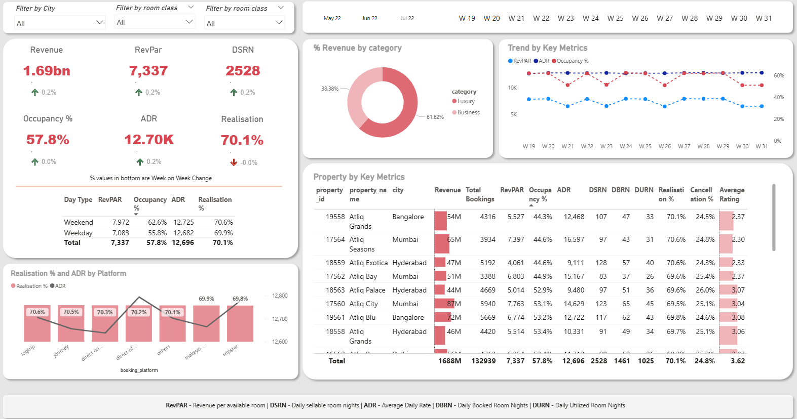

# Revenue Insight

📌 Project Overview 

A 5-star hotel struggles with their market loss thus this Power BI dashboard provides revenue insights to facilitate data-informed decision-making across various key metrics. Using Power BI, I analysed data to track revenue by category, trends by key metrics, property performance, realization percentage, and several other KPIs.

🔹 Objectives

- Generate data-driven decisions
- Analyze trends over time
- Identify top-populated days in hotel
- Keep track of Customers and Ratings

🛠 Tools & Technologies

Power BI – Dashboard & Visualization

📈 Dashboard Features

KPIs: Revenue, Revenue Per Available Room, Average Daily Rate, Occupancy %, Daily Booked vs Utilized Room Nights.

Visuals:
- Revenue % by Category
- Trends and properties by Key metrics
- Pie chart, Bar chart, Line chart, tables

📸 Dashboard

